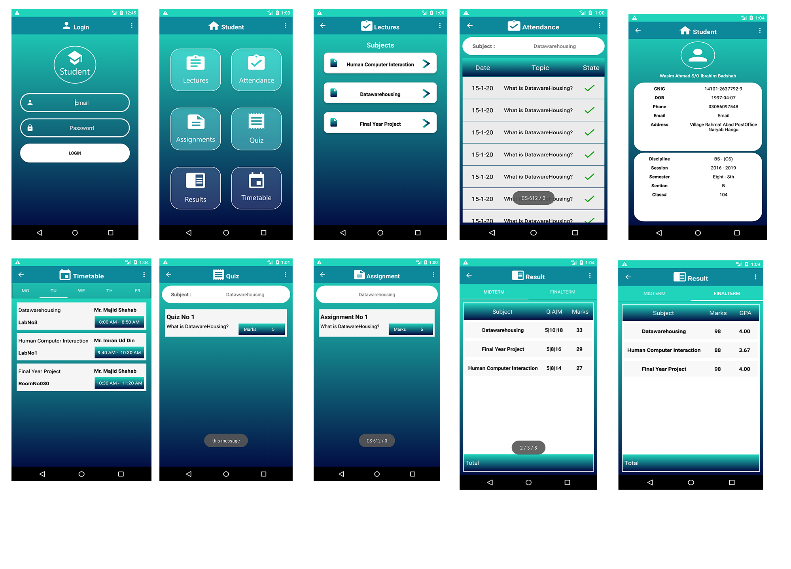

# AUP_Student_Portal
This app is made for IBMS the departmant of AUP university peshawar

This app use kotlin for programming and mysql for database and php for restful api.

Note: This app is setup for local server. So both api and database are avalible in repostry you can set accodiing to your needs.

This app is made using Android Gradle plugin version : 3.2.1 Gradle version :4.6

minSdkVersion 16 targetSdkVersion 28

The back end of this app is made in bootstarp and php which is present in another repostry by name of UniPortal

Complete app UI are given below

